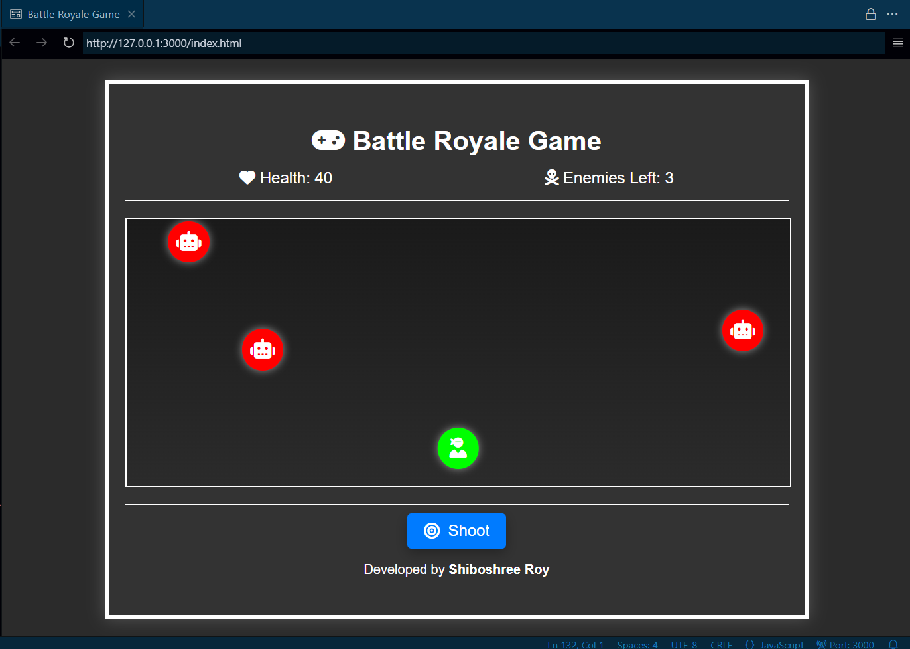
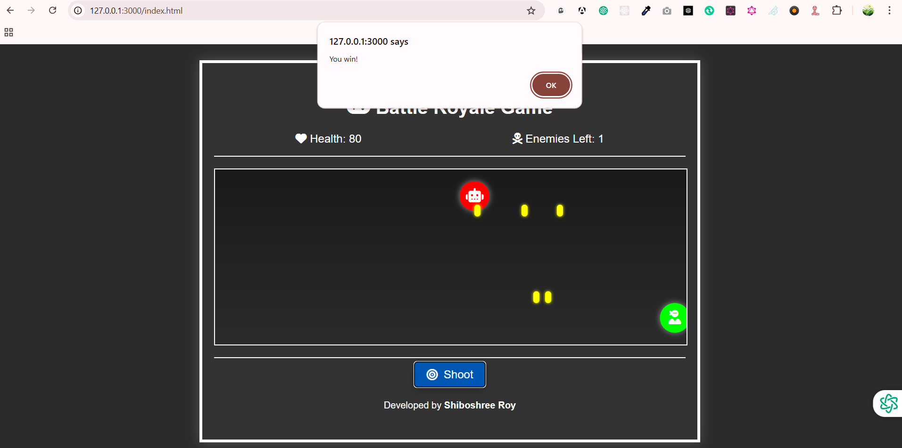

# Battle Royale Game(GTP)

## Description

Welcome to **Battle Royale Game(GTP)**, an exciting 2D battle royale game where you play as a lone hero fighting against waves of enemies. Your goal is to survive, shoot enemies, and stay alive as long as possible.

The game features a simple interface with dynamic gameplay elements, including player health, enemy count, and an action button to shoot. The game is styled with modern, interactive, and responsive 3D UI elements.

## Features

- **Player Movement:** Control your player within the game area.
- **Enemies:** Face off against multiple enemies in a dynamic battle.
- **Shooting Mechanism:** Shoot projectiles towards enemies using the shoot button.
- **Stats:** Displays health and remaining enemies.
- **3D UI Design:** Modern and interactive 3D design elements for an immersive experience.

## Technologies Used

- **HTML5**: Markup for the game's structure.
- **CSS3**: Styling with advanced 3D effects, animations, and responsive layouts.
- **JavaScript**: Game logic, player interactions, and event handling.
- **GitHub Pages**: For hosting and sharing the game.

## Getting Started

To play the game locally, follow these steps:

### Prerequisites

Make sure you have the following installed on your system:

- A web browser (Chrome, Firefox, etc.)
- A text editor or IDE (e.g., VS Code, Sublime Text)

### Installation

1. **Clone the repository:**
   ```
   git clone https://github.com/ShiboshreeRoy/Battle-Royale-Game-GTP-.git
   ```

2. **Navigate to the project folder:**
   ```
   cd battle-royale-game(GTP)
   ```

3. **Open the `index.html` file in your browser** to play the game.

### Project Structure

The project consists of the following files:

```
battle-royale-game/
│
├── index.html         # Main HTML file with game layout
├── app/               # Folder containing game logic and assets
│   ├── assets/        # Game styles and images
│   └── config/        # JavaScript logic
│
└── README.md          # Project documentation
```

## Gameplay Instructions

- **Health**: Your current health is displayed in the top-left corner of the game screen.
- **Enemies Left**: The number of remaining enemies is shown in the top-right corner.
- **Shoot Button**: Press the "Shoot" button to fire a bullet at the enemies.

## Screenshots

Here are some screenshots of the game:




---

## About Me

Hello! My name is **Shiboshree Roy**, and I am a passionate developer (Full Stack ROR Dev) with a focus on web development, gaming, and 3D design. I enjoy creating interactive and engaging user experiences, and this game is one of my projects that showcases my skills in front-end development, JavaScript, and CSS3 animations.

### Contact Me

- **GitHub**: [@shiboshreeroy](https://github.com/shiboshreeroy)
- **LinkedIn**: [Shiboshree Roy](https://bd.linkedin.com/in/shiboshree-roy)
- **Email**: shiboshreeroy169@gmail.com

---

## License

This project is licensed under the MIT License - see the [LICENSE](LICENSE) file for details.

---

### How to Contribute

Feel free to fork the repository, make changes, and submit pull requests. I'd love to collaborate with others who are passionate about creating great games and UI design.

---

### Acknowledgments

- **CSS3** for the 3D and animation effects.
- **JavaScript** for the interactive game logic.
- **GitHub Pages** for hosting this project.

